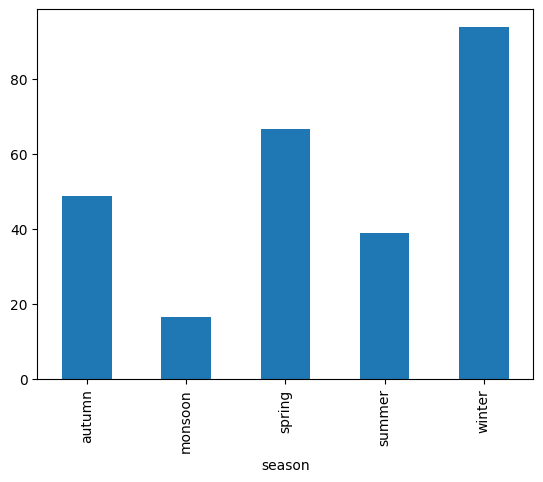
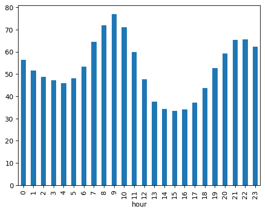
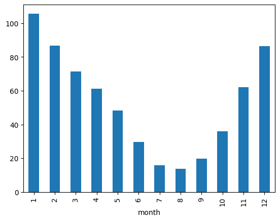
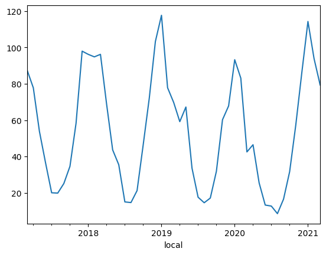
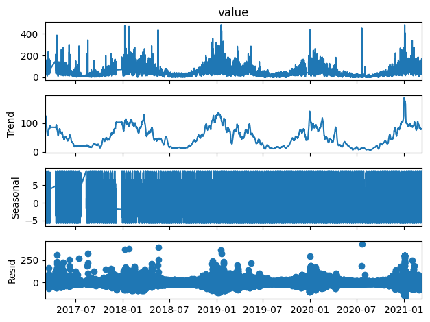
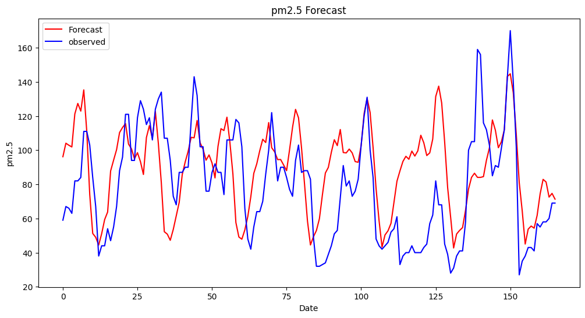

# Pm25-prediction
Forecast PM2.5 air pollution in Kathmandu using time series analysis. The project performs EDA, data cleaning, seasonal and daily trend analysis, and uses SARIMAX modeling with STL decomposition to predict future PM2.5 levels.

## Dataset
Source: https://opendatanepal.com/datasets/air-quality-data-in-kathmandu

Description: Dataset containing air quality data in Kathmandu from Jan 1, 2015 to Mar 13, 2021 primarily aggregate PM2.5, PM10, ozone (O3), sulfur dioxide (SO2), nitrogen dioxide (NO2), carbon monoxide (CO), and black carbon (BC) measurements.

## Project Overview
### 1.Data Cleaning and EDA

Extracted only PM2.5 values for analysis.

Observed erroneous sensor readings (<0 or >500) and replaced them using linear interpolation.

Generated daily, monthly, and seasonal plots to understand pollution patterns.

### 2.Key Observations

Seasonal trend: PM2.5 peaks in winter and is minimum during monsoon:
Winter > Spring > Summer > Monsoon

Monthly trend: Highest in January, lowest in July, gradually increasing towards December.

Daily trend: Peaks during early office hours (~9:00 AM), minimum during midday, rises again in the evening (~5:00 PM).

Clear daily and seasonal patterns are visible in the PM2.5 levels.

### 3.Time Series Analysis

Stationarity was checked using the ADF test.

STL decomposition was used to separate the time series into:

Trend

Seasonality

Residuals

### 4.SARIMAX Forecasting

Optimal parameters for the SARIMAX model were identified using auto_arima for both trend and residual components.

Forecasted trend and residuals were combined with seasonality to generate final PM2.5 predictions.

### 5.Model Performance

Predictions were compared with actual PM2.5 values and a plot was generated.

Mean Absolute Error (MAE) was calculated to be 24.900.

